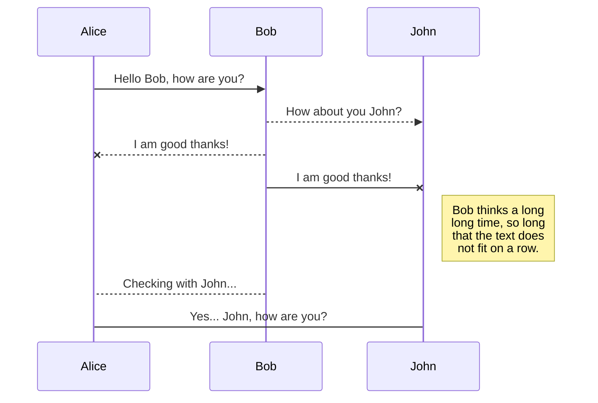

# 화면에 버튼과 기능 넣기

## 1)
``` python
# -*- coding: utf-8 -*-  
# 위를 utf-8로 인코딩 해놓는다!  
  
import sys  
# sys라는 모듈(파일)을 가지고 오겠다.  
import PyQt5  
from PyQt5.QtGui import * # PyQt5라는 클래스의 QtGui라는 변수를 가지고 온다.  
from PyQt5.QtCore import *  
from PyQt5.QtWidgets import *  
from PyQt5 import uic  
  
CalUI = '../_uiFiles/calculator.ui' # ui 상대경로를 저장  
  
class MainDialog(QDialog):  
    def __init__(self):  
        QDialog.__init__(self, None)  
        uic.loadUi(CalUI,self)      # ui를 load한다.  
 # clicked connect method를 사용해서 버튼에 기능을 얹는다.  self.num_pushButton_1.clicked.connect(self.NumClicked) # 버튼 클릭시 괄호안의 함수를 실행시킨다..  
 # 버튼에 적혀있느 글자 가져오기 .text() 메서드를 이용한다.  def NumClicked(self):  
        print("나 클릭됐다~") # 2-2콘솔창에 뜨는것을 확인.  
  print(self.num_pushButton_1.text())  
        exist_line_text = self.q_lineEdit.text()  
        now_num_text = self.num_pushButton_1.text()  
        self.q_lineEdit.setText(exist_line_text +now_num_text)  
  
        # self.setFixedSize(300,200) # 가로px, 세로px 창크기를  
 # self.lineEdit = QLineEdit(self) # 글을 쓸 수 있는 editbox를 만들어줌 # self.pushButton = QPushButton(self) # 이렇게만 쓰면 겹쳐서 보임 # self.pushButton.move(0,100)  
app = QApplication(sys.argv) # 변수를 선언  
main_dialog = MainDialog() # maindialog 클래스를 상속  
main_dialog.show() # main_dialog를 보여준다.  
app.exec_()        # 프로그램을 이벤트루프로 진입시켜주는 역할
```



<!--stackedit_data:
eyJoaXN0b3J5IjpbLTQ0NTMxMzE1NCwxODY0MDgyMzcxLC0yMD
g4NzQ2NjEyXX0=
-->